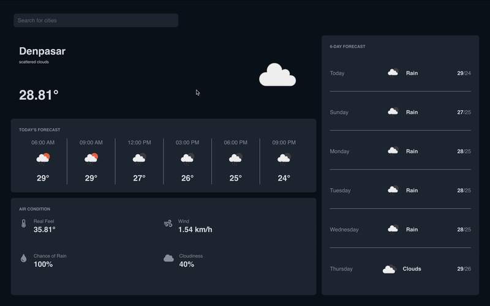

# 🌤️ Vue 3 Weather App with Laravel Backend

A weather application built using Vue 3 Composition API and Laravel backend. It displays current weather and weekly day forecasts using data from the OpenWeatherMap API.

---

## 🚀 Features

- 🌐 Real-time weather & forecast (weekly day / 3-hour intervals)
- 📍 Location-based search (city name)
- 📊 Forecast summary by day
- 🌥️ Today’s hourly forecast
- 🌡️ Temperature, humidity, cloudiness

---

## 🧩 Tech Stack

| Frontend       | Backend               | Styling     |
|----------------|-----------------------|-------------|
| Vue 3 + Vite   | Laravel 10            | Tailwind    |
| Pinia          | Laravel Actions       | SASS        |
| Axios          | Laravel HTTP Client   | FontAwesome |

---

## 📦 Backend Setup Instructions
composer install
cp .env.example .env
php artisan key:generate
php artisan serve

## 📦 Frontend Setup Instructions
npm install
npm run dev

MIT © 2025 Tude Verdhangga
